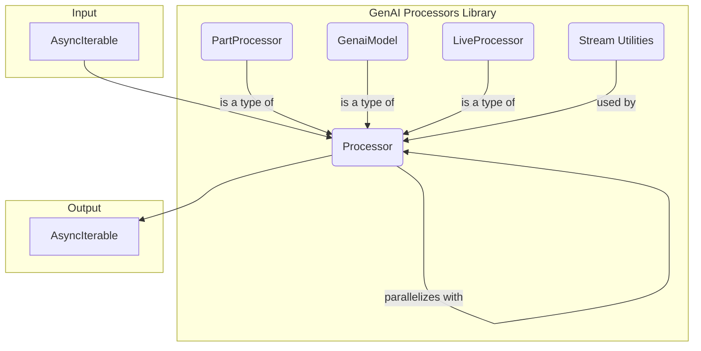

```mermaid
graph TD
    subgraph "Input"
        A[AsyncIterable<ProcessorPart>]
    end

    subgraph "GenAI Processors Library"
        B(Processor)
        C(PartProcessor)
        D(GenaiModel)
        E(LiveProcessor)
        F(Stream Utilities)
    end

    subgraph "Output"
        G[AsyncIterable<ProcessorPart>]
    end

    A --> B
    B --> G

    B -- chains with --> B
    B -- parallelizes with --> B

    C -- is a type of --> B
    D -- is a type of --> B
    E -- is a type of --> B

    F -- used by --> B
```
